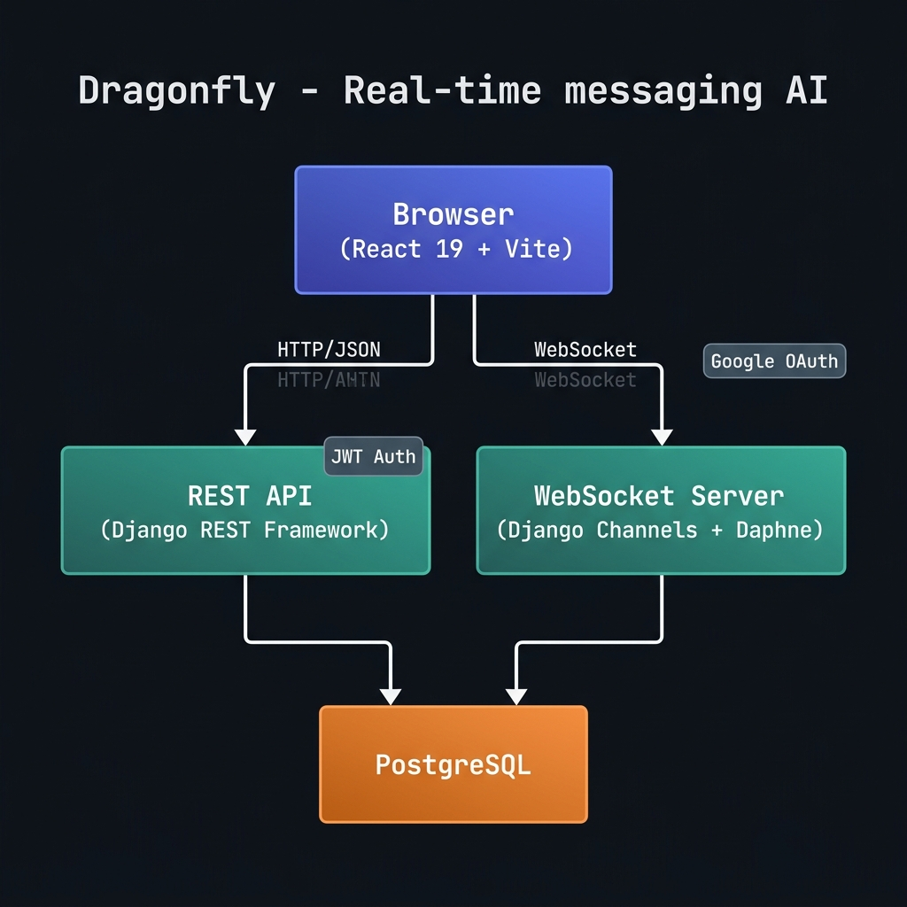

<div align="center">


# Dragonfly

**A production-grade, full-stack real-time messaging platform.**
Built with Django, React, WebSockets, and industry-standard engineering practices.

[](https://github.com/jitendra-ky/dragonfly/actions/workflows/tests_ci.yml)
[](https://codecov.io/gh/jitendra-ky/dragonfly)
[](https://github.com/jitendra-ky/dragonfly/releases)
[](https://github.com/astral-sh/ruff)
[](https://github.com/prettier/prettier)
[](https://github.com/jitendra-ky/dragonfly/blob/main/LICENSE)
[](https://github.com/jitendra-ky/dragonfly/graphs/contributors)
[](https://github.com/jitendra-ky/dragonfly/stargazers)
[](https://hub.docker.com/r/jitenky/dragonfly-test)
[](https://github.com/jitendra-ky/)

</div>

---

## ✨ Features

- 🔴 **Real-time messaging** — Persistent WebSocket connections via Django Channels & Daphne (ASGI)
- 🔐 **JWT authentication** — Stateless auth with access/refresh token rotation (SimpleJWT)
- 📧 **OTP email verification** — 6-digit OTP-based account activation on signup
- 🔑 **Google OAuth 2.0** — One-click sign-in with Google account via OAuth authorization code flow
- 🔄 **Forgot/Reset password** — OTP-based secure password recovery
- 📬 **Contact management** — Auto-discovery of contacts from message history
- 🏥 **Health check endpoint** — Production deployment monitoring at `/api/health/`
- 🐳 **Dockerized CI pipeline** — Tests run in Docker containers on every push/PR via GitHub Actions
- 🚀 **Deployed on Render** — ASGI server (Daphne) with `render.yaml` infrastructure-as-code

---

## 🏗️ System Architecture



---

## 🛠️ Tech Stack

| Layer | Technology |
|---|---|
| **Frontend** | React 19, Vite 7, React Router v7, Zustand, TailwindCSS |
| **Backend** | Django, Django REST Framework |
| **Real-time** | Django Channels, Daphne (ASGI / WebSocket server) |
| **Auth** | SimpleJWT, Google OAuth 2.0, OTP email verification |
| **Backend Testing** | Django Test Client, Coverage.py, Codecov |
| **Frontend Testing** | Vitest, React Testing Library, jsdom |
| **Code Quality** | Ruff (all rules), Prettier, ESLint |
| **CI/CD** | GitHub Actions (Tests CI, Docker build & push) |
| **Containerization** | Docker (Dockerized test environment on CI) |
| **Deployment** | Render (ASGI), `render.yaml` infrastructure-as-code |

---

## 📁 Project Structure

```
dragonfly/
├── .github/
│   ├── workflows/
│   │   ├── tests_ci.yml                  # CI: runs backend + frontend tests on every PR
│   │   ├── build_and_push_docker_image.yml
│   │   └── build_and_push_producction_image.yml
│   └── ISSUE_TEMPLATE/
│
├── zserver/                              # Core Django application
│   ├── models/
│   │   ├── user_profile.py               # Custom User, UnverifiedUser, OTP models
│   │   └── message.py                    # Message model
│   ├── views/
│   │   ├── user_profile.py               # Auth, signup, Google OAuth, password reset
│   │   └── message.py                    # Messages, contacts, all-users
│   ├── serializers/                      # DRF serializers with business logic
│   ├── tests/                            # Comprehensive automated test suite
│   ├── consumers.py                      # WebSocket consumer (JWT-authenticated)
│   └── urls.py                           # All API route definitions
│
├── frontend/                             # React + Vite SPA
│   └── src/
│       ├── components/                   # Reusable UI components
│       ├── pages/                        # Route-level page components
│       ├── store/                        # Zustand global state management
│       ├── hooks/                        # Custom React hooks
│       ├── services/                     # Axios API service layer
│       └── types/                        # TypeScript-compatible type definitions
│
├── zproject/                             # Django project config (settings, ASGI, routing)
├── tools/dockerfiles/                    # Dockerfiles for CI test environment
├── docs/                                 # Developer documentation
├── render.yaml                           # Render deployment config (IaC)
└── pyproject.toml                        # Ruff linting config
```

---

## 📮 API Reference

### Authentication & Users

| Method | Endpoint | Auth | Description |
|--------|----------|------|-------------|
| `POST` | `/api/user-profile/` | Public | Register a new user (triggers OTP email) |
| `POST` | `/api/sign-up-otp/` | Public | Verify OTP → activate account + return JWT |
| `POST` | `/api/sign-in/` | Public | Login with email/password → return JWT tokens |
| `GET` | `/api/user-profile/` | JWT | Get authenticated user's profile |
| `PUT` | `/api/user-profile/` | JWT | Update authenticated user's profile |
| `DELETE`| `/api/user-profile/` | JWT | Delete authenticated user's account |
| `POST` | `/google-login/` | Public | Google OAuth 2.0 login → return JWT |
| `POST` | `/api/forgot-password/` | Public | Send OTP for password reset |
| `POST` | `/api/reset-password/` | Public | Reset password using OTP |

### Messaging

| Method | Endpoint | Auth | Description |
|--------|----------|------|-------------|
| `GET` | `/api/messages/` | JWT | Fetch message history with a contact |
| `POST` | `/api/messages/` | JWT | Persist a sent message |
| `GET` | `/api/contacts/` | JWT | Get all users you've messaged |
| `GET` | `/api/all-users/` | JWT | Get all registered users |

### Token & System

| Method | Endpoint | Auth | Description |
|--------|----------|------|-------------|
| `POST` | `/api/token/` | Public | Obtain JWT token pair |
| `POST` | `/api/token/refresh/` | Public | Refresh access token |
| `POST` | `/api/token/verify/` | Public | Verify a token |
| `GET` | `/api/health/` | Public | Health check for deployment monitoring |

### WebSocket

| Protocol | Endpoint | Auth | Description |
|----------|----------|------|-------------|
| `WS` | `/ws/chat/?token=<JWT>` | JWT (query param) | Real-time bidirectional messaging |

---

## 🧪 Testing & Code Quality

Dragonfly enforces quality at every layer of the stack:

**Backend**
- Automated tests run via Django's test client, tracked with `coverage.py`
- Coverage reports uploaded to [Codecov](https://codecov.io/gh/jitendra-ky/dragonfly) on every CI run
- [Ruff](https://github.com/astral-sh/ruff) with **all rules enabled** for linting + formatting

**Frontend**
- Unit and integration tests with [Vitest](https://vitest.dev/) + [React Testing Library](https://testing-library.com/)
- [ESLint](https://eslint.org/) + [Prettier](https://prettier.io/) enforced on CI

**CI Pipeline (GitHub Actions)**
- Backend: Docker container is built, tests run inside it, coverage uploaded to Codecov, Ruff linter verified — all on every push/PR to `main`
- Frontend: Dependencies installed, ESLint run, Vitest test suite executed — on every push/PR to `main`
- Docker images built and pushed to [Docker Hub](https://hub.docker.com/r/jitenky/dragonfly-test)

---

## 🚀 Getting Started

See [docs/setup-dev-environment.md](docs/setup-dev-environment.md) for the full setup guide.

**Quick start:**

```bash
# 1. Clone the repo
git clone https://github.com/jitendra-ky/dragonfly.git
cd dragonfly

# 2. Copy and configure environment variables
cp .env.example .env
# Edit .env with your settings

# 3. Backend setup
pip install -r requirements/development.txt
python manage.py migrate
python manage.py runserver

# 4. Frontend setup (in a separate terminal)
cd frontend
cp .env.example .env
npm install
npm run dev
```

---

## 🤝 Contributors

We appreciate everyone 💖 who has contributed their time, skills, and passion to make Dragonfly better. Your efforts help drive this project forward — thank you!

<a href="https://github.com/jitendra-ky/dragonfly/graphs/contributors">
  
</a>

### How to Contribute

We welcome contributions from everyone! Please review our **[CONTRIBUTING.md](./CONTRIBUTING.md)** and **[CODE_OF_CONDUCT.md](./CODE_OF_CONDUCT.md)** before getting started.

1. **Fork & Clone** — Fork this repo and clone it locally
2. **Branch** — Create a new branch for your changes
3. **Implement & Test** — Make your changes and run the test suite
4. **Pull Request** — Open a PR against `main` for review

For details, see [CONTRIBUTING.md](./CONTRIBUTING.md).

---

<div align="center">

[](https://github.com/jitendra-ky/dragonfly/blob/main/LICENSE)
[](https://github.com/jitendra-ky/dragonfly)

</div>
